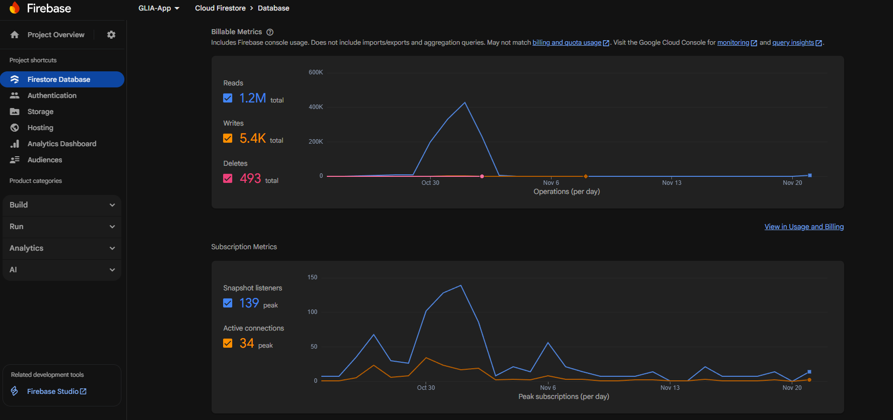
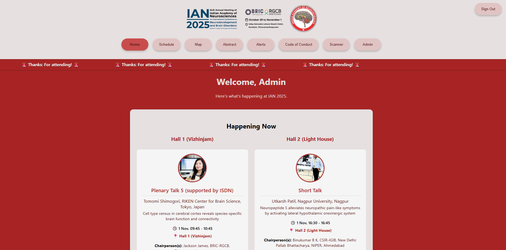
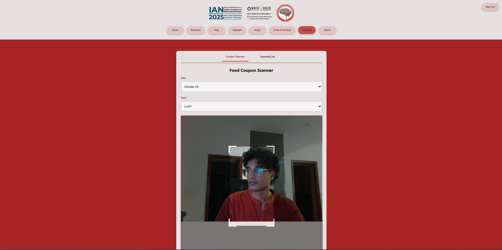
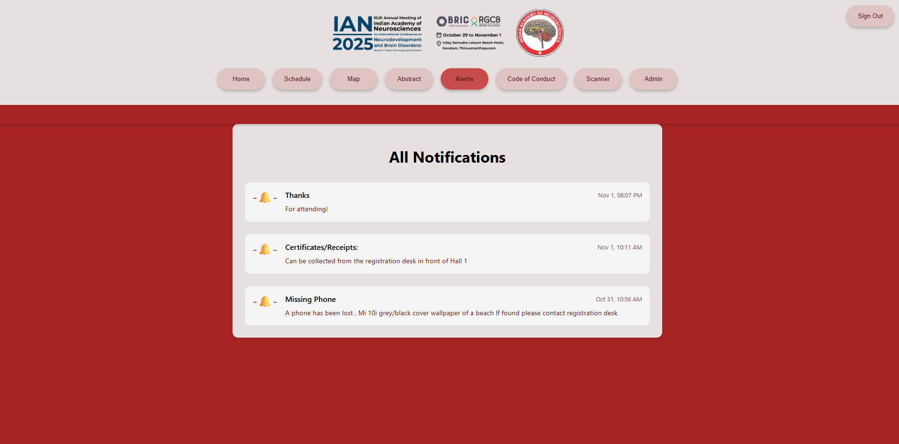

# 🧠 IAN 2025 Conference Platform (Official)


The official Progressive Web App (PWA) developed for the **XLIII Annual Meeting of the Indian Academy of Neurosciences (IAN 2025)**. 

This platform served as the digital operating system for the international conference hosted by **RGCB**, handling real-time scheduling, logistics, and dining management for hundreds of delegates.

---

## 🚀 Impact & Scale (Oct 29 - Nov 1)

This system was deployed live at the Uday Samudra Leisure Beach Hotel, managing high-concurrency traffic with zero downtime.

| Metric | Value | Description |
| :--- | :--- | :--- |
| **Total Database Reads** | **1,200,000+** | Powered by Firestore real-time snapshot listeners |
| **Meals Scanned** | **2,275** | Digital tracking for lunch & dinner via QR Code |
| **Active Connections** | **100+ Concurrent** | Sustained traffic during session breaks |
| **Uptime** | **100%** | Zero crashes during the 4-day event |


*(Real-time traffic analysis showing 1.2M reads peak)*

---

## ✨ Key Features

### 📱 For Attendees (Public View)
* **Live Schedule:** Real-time synchronization of sessions across multiple halls.
* **"Happening Now" Logic:** Auto-detects current time to display ongoing sessions instantly.
* **Venue Navigation:** Integrated Google Maps for shuttle routes and venue layout.
* **Live Alerts:** Instant notifications for schedule changes or lost & found items.

### 🛡️ For Organizers (Admin Dashboard)
* **Food Coupon Scanner:** A built-in QR Code scanner (using `html5-qrcode`) that validated meal eligibility in <1 second.
* **Digital Signage Control:** Manual override controls to change displays in the main halls (Vizhinjam & Light House) remotely.
* **Data Export:** One-click CSV generation for attendance and meal consumption reports.
* **Crisis Management:** Push alert system to broadcast urgent messages to all connected devices.

---

## 📸 Screenshots

| Admin Dashboard | Food Scanner |
|:---:|:---:|
|  |  |
| *Central control for events & alerts* | *Processed 2,275 meals* |

| Live Display Override | Real-time Alerts |
|:---:|:---:|
|  |  |
| *Remote control for hall screens* | *Instant communication channel* |

---

## 🛠️ Tech Stack & Architecture

**Frontend:**
* **React.js:** Component-based architecture for seamless state management.
* **HTML5-QRCode:** For browser-based camera access and QR decoding.
* **CSS3:** Custom responsive design.

**Backend (Serverless):**
* **Firebase Firestore:** NoSQL database using **Snapshot Listeners** for real-time data sync across client devices.
* **Firebase Authentication:** Secure login for admin personnel.
* **Firebase Hosting:** Fast content delivery.

**Why the Reads were so high (1.2M)?**
The app utilized aggressive real-time listeners. Every time a schedule change occurred or an alert was pushed, every connected client updated instantly without refreshing the page, ensuring delegates never saw outdated info.

---

## 🚀 Local Development Setup

1.  **Clone the repository**
    ```bash
    git clone [https://github.com/AdityaManojA/ian-2025-conference-app.git](https://github.com/AdityaManojA/ian-2025-conference-app.git)
    cd ian-2025-conference-app
    ```

2.  **Install Dependencies**
    ```bash
    npm install
    ```

3.  **Configure Firebase**
    Create a `.env` file in the root directory:
    ```env
    REACT_APP_FIREBASE_API_KEY=your_api_key
    REACT_APP_FIREBASE_AUTH_DOMAIN=your_project.firebaseapp.com
    REACT_APP_FIREBASE_PROJECT_ID=your_project_id
    REACT_APP_FIREBASE_STORAGE_BUCKET=your_bucket.appspot.com
    REACT_APP_FIREBASE_MESSAGING_SENDER_ID=your_sender_id
    REACT_APP_FIREBASE_APP_ID=your_app_id
    ```

4.  **Run Locally**
    ```bash
    npm start
    ```

---

## 👤 Author

**Aditya Manoj**
* Full Stack Developer & AI/ML Engineer
* [LinkedIn Profile]([https://linkedin.com/in/your-profile](https://www.linkedin.com/in/aditya-manoj-a-0a930b256/))

---

## 📄 License

This project is licensed under the MIT License - see the [LICENSE](LICENSE) file for details.
